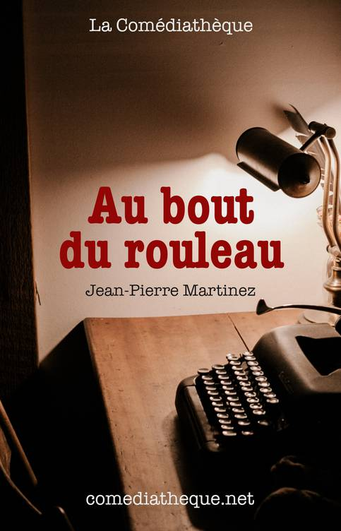

# {{title}}

<figure style="text-align:center">

</figure>

<section>

1. L'étymologie de l'expression
    > quand une personne ne sait pas quoi dire, ni comment réagir, on imagine qu'elle est comme à la fin de son texte de théâtre. On dit alors qu’elle est "au bout de son rôlet". (Bern)

1. L'incipit
    > _Un salon en désordre. Un homme (ou une femme) somnole dans un fauteuil. Le
    > téléphone sonne, le sortant de sa torpeur. Il décroche comme un somnambule._
    >
    > **Auteur** _(peu aimable)_ -- Allô ! _(Sans prendre le temps d’écouter)_  
    > Vous allez me dire que le rendez-vous est annulé, c’est ça ?  
    > (Reprenant un peu ses esprits) Le Crédit
    > Mutuel ?  
    >
    > _(Se radoucissant)_ Ah pardon, non parce que j’attends un journaliste qui doit
    > m’interviewer et...  
    >
    > Oui, je sais, un petit découvert, j’ai vu ça... Un gros ? Disons un
    > moyen, alors... Bon, on ne va pas jouer sur les mots, non plus... Ne vous inquiétez
    > pas, je m’apprêtais justement à sortir pour aller déposer un chèque que je viens de
    > recevoir...  
    >
    > Une avance pour l’écriture de ma prochaine pièce, oui... Vous allez au
    > théâtre de temps en temps ?
    >
    > Non bien sûr, ce n’est pas le sujet... Écoutez, la ligne
    > n’est pas très bonne... Ah, je crois que j’ai entendu sonner, ça doit être mon
    > journaliste... Oui, c’est ça, je vous rappelle... Ah, là je ne vous entends plus du tout...
    > Je vais vraiment être obligé de raccrocher...
    >
    > (Martinez 6)

1. Lionel Abel dans _Metatheatre: A New View of Dramatic Form_ (cité par Thumiger 10)

    > theatre pieces about life seen as already theatricalized… [whose characters] themeselves know they were dramatic before the playwright took note of them.

1.
    > **Un** -- Vous croyez qu'ils vont venir ?
    > 
    > **Deux** -- Qui ça ?
    > 
    > **Un** -- Les gens !
    > 
    > **Deux** -- Les gens ? Vous voulez dire le public\...
    > 
    > **Un** -- Les spectateurs, quoi !
    > 
    > **Deux** -- Ah, oui, les spectateurs\...
    > 
    > **Un** -- On ne peut pas jouer s'il n'y a pas de spectateurs.
    >
    > (Martinez 3)
1.
    > **Auteur** *(au public)* -- Être ou ne pas être\...? Shakespeare avait
    > raison, c'est bien la question. En tout cas, moi, c'est ce que je me
    > demande tous les matins en me regardant dans la glace. *(S'adressant
    > éventuellement à quelqu'un de jeune dans la salle)* Quand on est jeune
    > et beau, évidemment, la réponse ne fait aucun doute.
    >
    > (Martinez 6)
1.
    > **Deux** -- Et maintenant, qu'est-ce qu'on fait ?
    > 
    > **Un** -- Comment ça, qu'est-ce qu'on fait ?
    > 
    > **Deux** -- Maintenant que les spectateurs sont là ! Il faut bien faire
    > quelque chose.
    > 
    > **Un** -- C'est que moi je n'ai rien préparé. Et vous ?
    > 
    > **Deux** -- Moi non plus.
    > 
    > **Un** -- On ne s'y attendait pas.
    > 
    > **Deux** -- C'est tellement soudain\...
    > 
    > **Un** -- On n'y croyait plus\...
    > 
    > **Deux** -- Depuis le temps.
    > 
    > **Un** -- C'est de leur faute aussi\...
    > 
    > **Deux** -- Ils auraient pu nous prévenir.
    > 
    > **Un** -- On ne va pas comme ça au théâtre à l'improviste.
    > 
    > **Deux** -- Ça ne se fait pas.
    > 
    > (Martinez 5)
1.
    > C'est bizarre,
    > j'ai fait un drôle de rêve. J'étais sur scène avec un partenaire de jeu.
    > La salle était vide. On se demandait si quelqu'un allait venir. Et puis
    > tout d'un coup, on se rendait compte que la salle était pleine. Le
    > drame, c'est que\... on n'avait rien à jouer.
    >
    > (Martinez 6)
1.
    > **Visiteuse** -- \... J'ai
    > une idée !
    > 
    > **Auteur** *(sursautant)* -- Vous m'avez presque fait peur\...
    > 
    > **Visiteuse** -- Un mec aime une fille, mais leurs familles se
    > détestent.
    > 
    > **Auteur** -- C'est *Roméo et Juliette*.
    > 
    > **Visiteuse** -- Un mec aime une fille, mais son père tue
    > accidentellement celui de la fille.
    > 
    > **Auteur** -- *Le Cid*.
    > 
    > **Visiteuse** -- Un mec aime une fille mais en réalité c'est un homme.
    > 
    > **Auteur** -- *Certains l'aiment chaud*.
    > 
    > **Visiteuse** -- Tiens, je ne la connais pas, cette pièce-là.
    > 
    > **Auteur** -- C'est un film.
    > 
    > **Visiteuse** -- Vous êtes sûr ?
    > 
    > **Auteur** -- Certain.
    > 
    > **Visiteuse** -- Un mec aime un mec mais en réalité c'est une fille.
    > 
    > **Auteur** -- *Victor Victoria*.
    > 
    > **Visiteuse** -- Une femme aime une femme mais en réalité c'est un
    > homme.
    > 
    > **Auteur** -- *Tootsie*.
    > 
    > **Visiteuse** -- Putain\... Je ne pensais pas que c'était si difficile
    > que ça d'être un auteur contemporain. Tout a déjà été écrit, alors\...?
    > 
    > **Auteur** -- Tout\...
    >
    > (Martinez 27-28)

1.
    > **Auteur** -- \... Alors, où est-ce qu'on en
    > était ?
    > 
    > **Visiteuse** -- Nulle part, j'en ai peur.
    > 
    > **Auteur** -- Oui, c'est bien ce que je craignais.
    > 
    > **Visiteuse** -- Et si on écrivait l'histoire d'un auteur qui a perdu
    > l'inspiration ?
    > 
    > **Auteur** -- Je vois\... Une nana sonne à sa porte, et elle prétend
    > être journaliste\...
    > 
    > **Visiteuse** -- Pourquoi pas ?
    > 
    > **Auteur** -- Le théâtre dans le théâtre\... Je m'étais promis de ne
    > jamais tomber aussi bas\...
    >
    > (Martinez 26)

1.
    > **Visiteuse** -- Un théâtre, qui souhaite monter votre dernière pièce à
    > Paris.
    > 
    > **Auteur** -- Un théâtre ? Quel théâtre ?
    > 
    > **Visiteuse** -- J'aurais dû noter le nom tout de suite, mais vous
    > m'avez interrompue\... Ça a quelque chose à voir avec le code de la
    > route\...
    > 
    > **Auteur** -- Le code de la route ?
    > 
    > **Visiteuse** -- Et ça évoque en même temps l'idée d'un théâtre qui
    > tourne en rond\...
    > 
    > **Auteur** -- Le Théâtre du Rond Point ?
    > 
    > **Visiteuse** -- C'est ça !
    > 
    > **Auteur** -- Mais ils ne jouent que des auteurs vivants !
    > 
    > **Visiteuse** -- Votre cadavre est encore chaud, on ne va pas chipoter,
    > non ?
    >
    > (Martinez 34)
1.
    > **Auteur** -- Pourquoi pas\... Mais quand vous dites ma dernière pièce,
    > vous voulez dire\...
    > 
    > **Visiteuse** -- Celle que vous n'avez pas encore écrite.
    > 
    > **Auteur** -- Mais puisque je suis mort ?
    > 
    > **Visiteuse** -- Vous avez entendu, je leur ai dit que vous aviez un
    > inédit.
    > 
    > **Auteur** -- Oui\... Mais je n'en ai pas\...
    > 
    > **Visiteuse** -- Comme vous n'êtes pas vraiment mort, vous allez pouvoir
    > l'écrire.
    > 
    > **Auteur** -- Enfin puisque je vous dis que j'ai perdu l'inspiration !
    > 
    > **Visiteuse** -- Ça c'était avant !
    > 
    > **Auteur** -- Avant ?
    > 
    > **Visiteuse** -- Avant que vous ne soyez redevenu un auteur à succès.
    > 
    > **Auteur** -- Vous voulez dire un auteur mort.
    > 
    > **Visiteuse** -- Aussi, oui\... Maintenant que vous avez toute la mort
    > devant vous, vous allez avoir le temps de l'écrire, cette pièce. Je
    > m'occuperai du reste.
    > 
    > **Auteur** -- Excusez-moi de poser cette question mais\... je vais
    > rester mort pendant combien de temps à peu près ?
    > 
    > **Visiteuse** -- Disons le temps d'écrire cette 124ème pièce. Après on
    > verra.
    >
    > (Martinez 35)

1.
    > **Visiteuse** -- Georges ? Cette fois, c'est bon. Je crois qu'il va
    > l'écrire, sa 124ème pièce\... OK, on y est peut-être allé un peu fort
    > avec le Prix du Boulevard Beaumarchais et la Médaille des Chiffres et des
    > Lettres\... C'est sûr,
    > il va être déçu en apprenant qu'il n'a ni l'un ni l'autre, mais bon\...
    > C'est pour son bien\... Et puis on ne sait jamais, si sa nouvelle pièce
    > est vraiment bonne\... Oui, vous avez raison, s'il n'est pas mort
    > avant\... À ce propos, il faudra que je vous explique. J'ai dû
    > improviser un peu\...
    >
    > (Martinez 35-36)

1.
    > **Auteur** -- Ne vous inquiétez pas. Je ne sais pas pourquoi mais tout à
    > coup, d'être mort, ça me redonne le moral.
    > 
    > **Visiteuse** -- Tant mieux\... Donc vous avez une idée ?
    > 
    > **Auteur** -- Il vaut toujours mieux partir de la réalité. Alors tant
    > pis. Va pour le théâtre dans le théâtre. C'est l'histoire d'un auteur
    > qui a perdu l'inspiration. Un jour, une journaliste vient sonner à sa
    > porte\...
    > 
    > **Visiteuse** -- Oui, ça me rappelle quelque chose\... Et vous avez déjà
    > un titre ?
    > 
    > **Auteur** -- Pourquoi pas\... « Au bout du rouleau » ?
    > 
    > **Visiteuse** -- Ça n'a pas déjà été fait ?
    > 
    > **Auteur** -- Ah oui mais alors là\... Si en plus il faut un titre
    > original\...
    > 
    > **Visiteuse** -- Va pour « Au bout du rouleau »\...
    > 
    > **Auteur** -- Si je vous dictais, ça irait plus vite non ? *(Il place
    > une vieille machine à écrire devant la visiteuse.)* Tenez, j'ai retrouvé
    > un rouleau\...
    > 
    > **Visiteuse** -- Je vous écoute\...
    >
    > (Martinez 36-37)

1.
    > *L'auteur commence à dicter, très inspiré, comme s'il voyait la scène.*
    > 
    > **Auteur** -- Un salon en désordre. Un homme somnole dans un fauteuil.
    > Tout à coup le téléphone sonne, le sortant de sa torpeur. Il décroche
    > comme un somnambule. Allô !
    > 
    > *Noir.*
    > 
    > ***Fin.***
    >
    > (Martinez 37)

</section>

<section class="bib">
    <header>Bibliographie</header>

- Bern, Stéphane. « D’où vient l’expression “être au bout du rouleau” ? » Europe 1, 2 octobre 2020, https://www.europe1.fr/culture/de-quel-rouleau-parle-t-on-dans-lexpression-etre-au-bout-du-rouleau-3995785.
- Martinez, Jean-Pierre. _Au bout du rouleau_. La Comédiatheque, Paris. https://jeanpierremartinez.net/au-bout-du-rouleau/
- Thumiger, Chiara. « On ancient and modern (meta)theatres: definitions and practices ». _Materiali e discussioni per l’analisi dei testi classici_ 63 (2009): 9‑58. Print.
</section>

